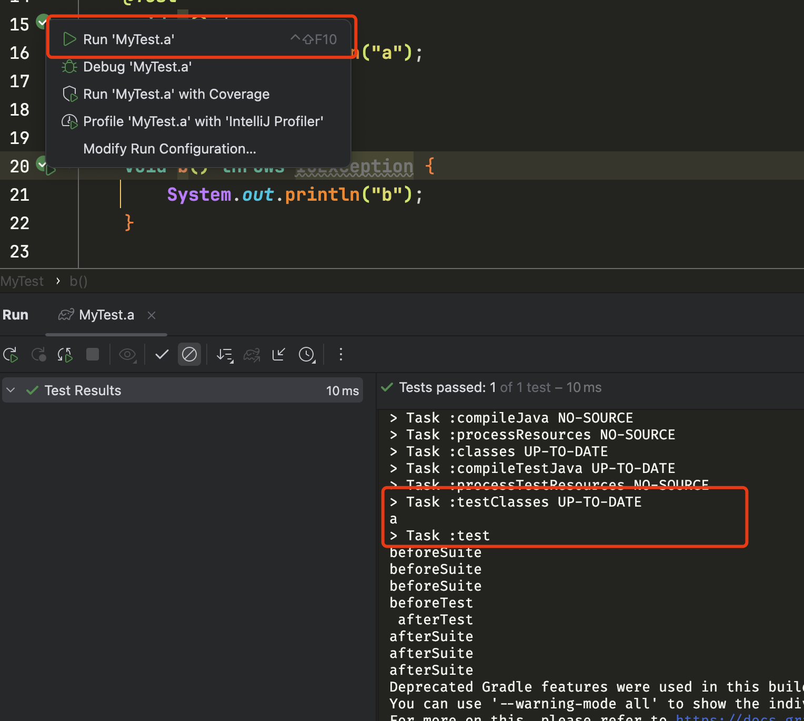

## Env

- MacOs 15.0.1
- IntelliJ IDEA 2024.3.1 (Ultimate Edition)
- Gradle 8.8
- JDK 17

## Command(Right)
run: 

```bash
 ./gradlew test
```
you can see:

```
> Task :test
beforeSuite 
beforeSuite 
beforeSuite 
beforeTest 

MyTest > a() STANDARD_OUT
    a
 afterTest  
beforeTest 

MyTest > b() STANDARD_OUT
    b
 afterTest  
beforeTest 

MyTest > c() STANDARD_OUT
    c
 afterTest  
afterSuite 
afterSuite 
afterSuite 
```

this Result contains My test listener and test case print,it's right.


## IDEA Click(Error)

Click on the green arrow to perform results different from what you expect




Test case details are mistakenly printed during the `testClasses` task instead of the `test` task


So My Hook function is error
